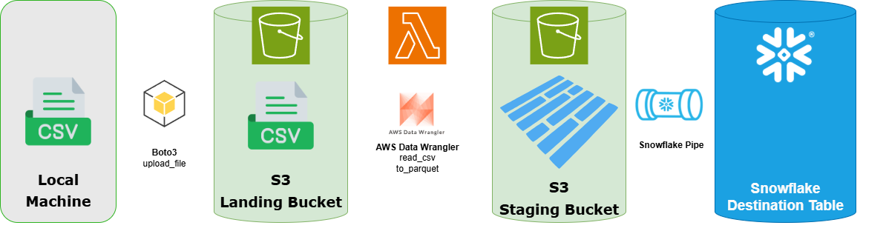

# Research

### Analysis Table
| Method | Purpose| Best Use Cases | Pros | Cons
|---|---|---|---|---|
|`upload_file` | Uploads a file to a S3 bucket | Used when you have a local file saved on your local machine | Useful for large files | Needs file on disk and less flexible for data sources |
| `upload_fileobj` | Uploads a stream of bytes or object in memory to an S3 bucket | Used for when data isn't saved in a file and is stored in memory | Faster, less resource intensive, allows more data sources | Cannot handle data larger than memory, needs manual handling for large data, requires binary mode | 
|`put_object`| Lower level upload to S3 that directly uses the AWS API | Best used when more control is needed when uploading | Useful for highly controlled uploads | More complex than upload_file and doesn't automatically handle multipart uploads|
|`download_file`| Downloads from an S3 bucket to a file | Used for when you have a file in the cloud and you want to download it to your local machine | Useful for large files and simple downloads | Takes up (temporary) space on your machine where the file was saved and is less flexible and slower than `upload_fileobj`|
|`download_filobj`| Downloads from an S3 bucket to a byte stream object in memory | Useful for when you don't want to save the downloaded file to the disk | Useful for more flexibility with the downloaded data and when you don't want to take up space in the disk | More complex than download_file and cannot handle files larger than the memory|
|`get_object` | Lower level download from S3 that directly uses the AWS API | Best used when more control is needed when downloading | Useful for highly controlled downloads | More complex than download_file and doesn't automatically handle multipart downloads|

### Reflection Questions:
1. **Upload Methods:**
    `upload_file` takes in a file on disk as an input and `upload_fileobj` takes in a file in memory such as a byte stream as an input. `upload_file` and `upload_fileobj` are both built on top of `put_object` which is a lower level API for uploading data to S3. This means that `upload_file` and `upload_fileobj` automatically handle multipart while a manual implementation is needed for `put_object`. You would choose `put_object` over `upload_file` or `upload_fileobj` when more control is needed for the upload as there are more parameters for `put_object`.

2. **Download Methods:** `download_file` is different from `download_fileobj` and `get_object` as `download_file` automatically handles downloading the file from S3 and saving it to the disk as a file. `get_object` and `download_fileobj` both download the file from S3 into streams of bytes in memory rather than the disk. `get_object` would be more beneficial than `download_file` when more control is needed for downloading data from S3 as `get_object` is a lower level API call and has more parameters.

3. **Efficiency and Performance:** Multipart uploads and downloads enhance the performance of file transfer operations by breaking down the data in the file into seperate chunks which are then downloaded or uploaded in parralel. The limitations of using `put_object` and `get_object` for large files is that they don't automatically have multipart functionality and a manual implementation must be made for multi part with these commands. This is more complex than using the higher abstracted functions but there is more control.

4. **Practical Applications:** In a scenario where you need to upload a large video file to S3, the `upload_file` function would be best. This is because this function automatically handles multipart uploads which is very beneficial for large video files. If you need to process data in memory before saving it locally, the `download_fileobj` function would be best as this allows data to be downloaded from S3 without the need to saving it locally. 


### Boto3:
#### Client API vs Resource API
Client API is a lower level API that is closer to the AWS service APIs. There functions have more control over the API calls and have more operations. The Resource API is a higher level abstraction for the AWS service API which abstract away many low level details of the interactions. This makes the API more simpler and allows for more intuitive interactions. This means that the Resource API is easer to write and understand but has less control over specifica calls.

# Final
### Diagram:


#### Skills utilized:
- python boto3 Client API
- python AWS data wrangler
- AWS S3 buckets
- AWS Lambda automatic data transfer/processing
- AWS S3 bucket event notifications
- Snowflake snowpipe interactions with S3 for automatic data transfer from S3 to snowflake
- Snowflake format
- Snowflake transient tables

### Bringing it all together:
This architecture would be used when the raw data source is in .csv format and the target destination is a snowflake table with processing done to convert the .csv file to .parquet format before using Snowpipe to convert the parquet file to a snowflake table. Because the pipeline is automated, this means that it can process large amounts of .csv files as raw data to snowflake tables in bulk, removing the need for manual uploads, transfers, and copies.


#### Boto3 Code:
```
s3_client.upload_file(Filename='test.csv',
                      Bucket='techcatalyst-raw',
                      Key=key)
```
Uploads raw data files from local machine to S3 Landing Bucket

#### Lambda AWS Wrangler Code:
```
import boto3
import awswrangler as wr
from urllib.parse import unquote_plus
import json

def lambda_handler(event, context):
    # Get the source bucket and object name from the Lambda event
    for record in event['Records']:
        source_bucket = record['s3']['bucket']['name']
        source_key = unquote_plus(record['s3']['object']['key'])
    
    print(f'Bucket: {source_bucket}')
    print(f'Key: {source_key}')
    
    input_path = f"s3://{source_bucket}/{source_key}"
    print(f'Input Path: {input_path}')
    
    # Define the destination bucket and key
    destination_bucket = "techcatalyst-public"  # Target bucket name as a string
    
    # Derive the output key (keep same folder structure, replace file extension with .parquet)
    if source_key.lower().endswith('.csv'):
        output_key = source_key[:-4] + ".parquet"
    else:
        output_key = source_key + ".parquet"
        
    output_path = f"s3://{destination_bucket}/{output_key}"
    print(f'Output Path: {output_path}')
    
    # Read the CSV file from S3
    try:
        input_df = wr.s3.read_csv([input_path])
    except Exception as e:
        print("error on read")
        print(e)
        return {
            'statusCode': 500,
            'body': json.dumps('Error reading source CSV file')
        }
    
    # Write the DataFrame to Parquet format in the destination S3 bucket
    result = wr.s3.to_parquet(
        df=input_df,
        path=output_path,
    )
    
    print("RESULT: ")
    print(result)
    
    return {
        'statusCode': 200,
        'body': json.dumps('CSV file converted to Parquet and moved successfully!')
    }
```
Checks for newly uploaded files in the S3 Landing Bucket. When a file is uploaded it converts them to .parquet and saves it to a staging bucket in .parquet format

#### Snowflake Snowpipe code:
```
create or replace pipe techcatalyst.external_stage.BEN_PIPE
auto_ingest = True
as
copy into techcatalyst.BEN.temp
from  @TECHCATALYST.EXTERNAL_STAGE.BEN_AWS_STAGE
FILE_FORMAT = (format_name = 'BEN.parquet_format')
match_by_column_name = case_insensitive;
```
Checks for newly uploaded files in the S3 Staging Bucket. When a .parquet file is uploaded to the /BEN/ folder in the staging bucket, it copies the data into a transient table ```techcatalyst.ben.temp```